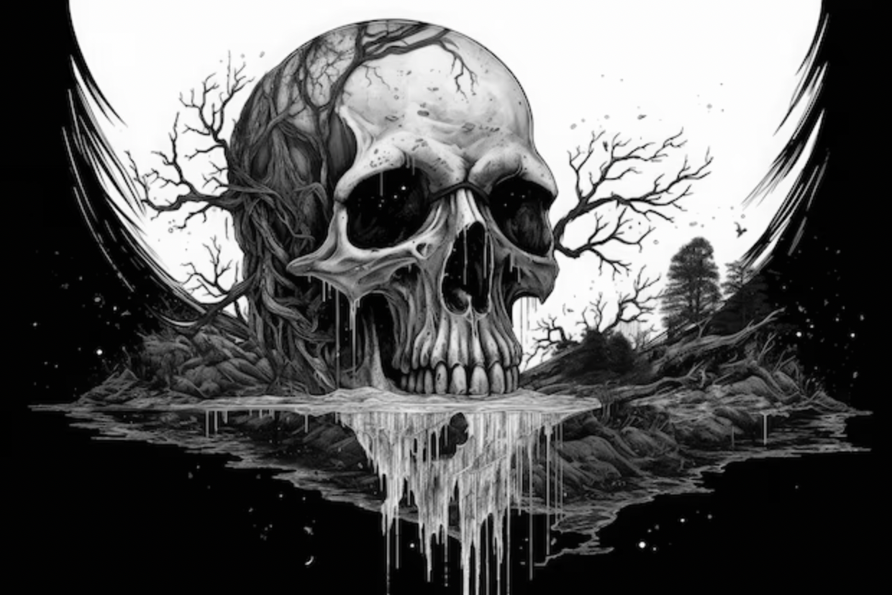
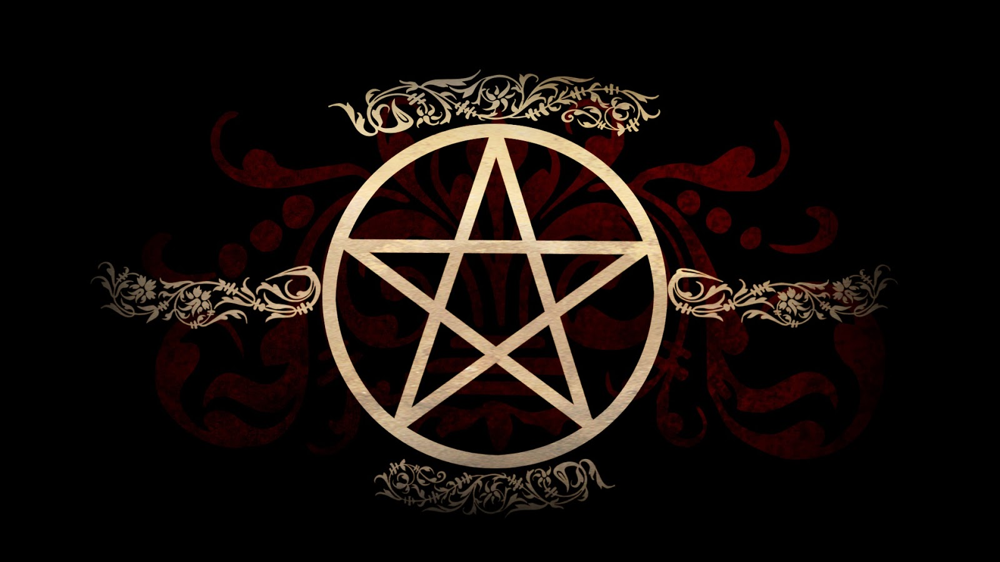
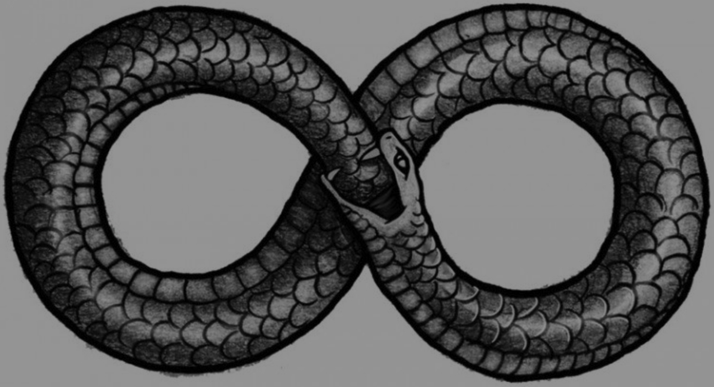
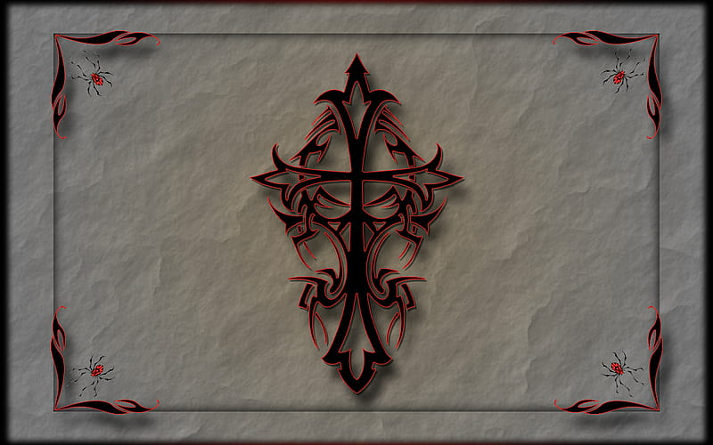
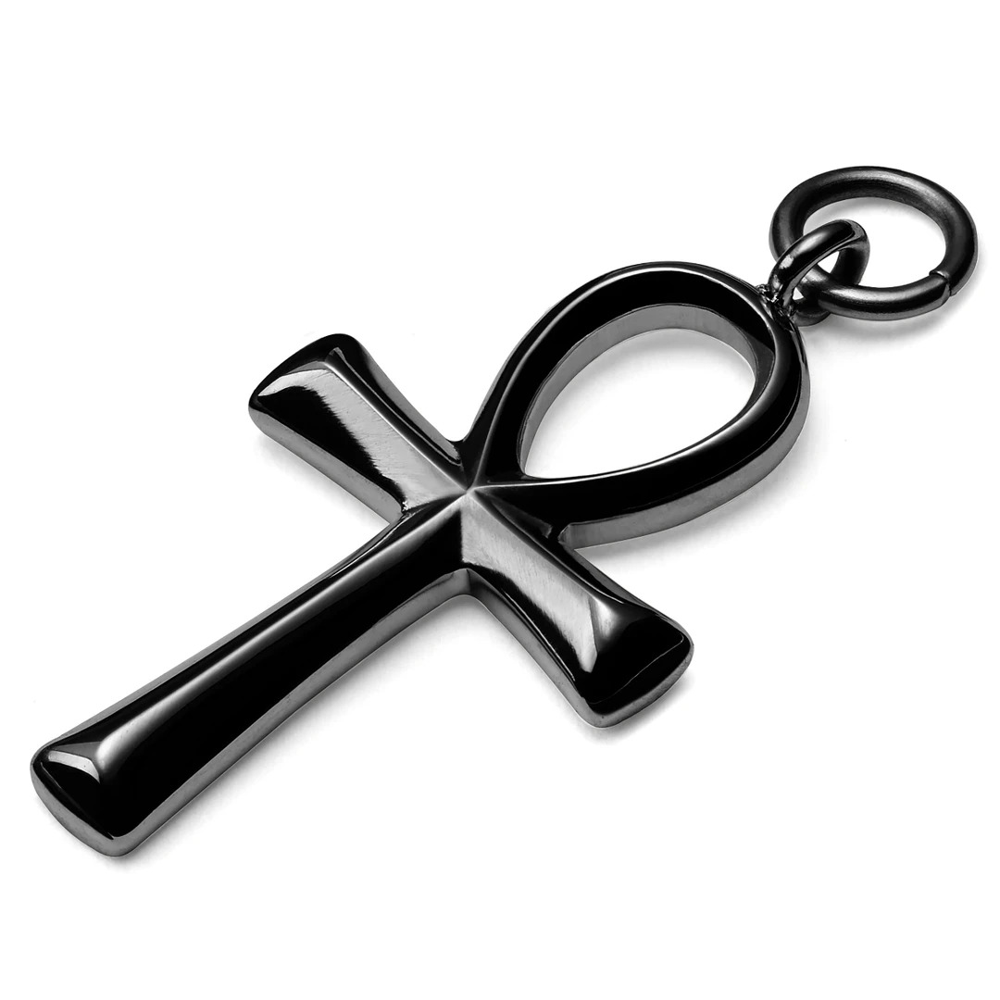

#

Come ogni cultura anche quella goth possiede dei simboli a cui è stato dato un significato, simboli che esistevano già prima e che hanno avuto diversi significati in base al periodo storico e al contesto socio-culturale. A parte qualche eccezione (ma neanche più di tanto) il significato di questi ultimi non viene stravolto, ma viene interpretato in maniera coerente all'interno della cultura stessa.

IL TESCHIO
---

Il teschio nella cultura gotica è stato adottato nella moda; gli sono stati attribuiti vari significati, in ogni caso è visto come un simbolo potente perchè rappresenta la **morte**, ma non solo, rappresenta anche la **vita eterna dopo** di essa, infatti come già detto nel post relativo alle origini, la vita ultraterrena è uno degli ideali di questa cultura. Il teschio è visto solitamnete come un elemento inquietante, ma in questo contesto non lo è, anzi viene visto anche come simbolo del **ciclo della vita**, in cui è compresa anche la morte, che come detto prima, nella cultura gotica è molto romanticizzata.
In passato il teschio ha avuto diversi significati; i Maya li ponevano negli altari durante i sacrifici, mentre ha assunto il significato di morte a partire dal medioevo, infatti in quel periodo non era raro trovarli come ornamneto nelle tombe; dopo verra associato ai pirati a partire dal XIV secolo.

-------
IL PENTAGRAMMA
---

Il pentagramma racchiuso in un cerchio (in questo caso anche chiamato pentacolo), da non confodere con quello satanista (è rovesciato), al giorno d'oggi rappresenta i **cinque elementi**: acqua, fuoco, aria, terra, spirito, ognuno corrispondente ad una della cinue punte.
In passato è stato usato da molte culture con significati differenti, ne hanno usufruito diverse religioni e l'antica Grecia, oggi è presente anche nella bandiera del Marocco; è stato usato anche dall'Italia negli anni di piombo per riferirsi alle brigate rosse.
Nella cultura occidentale è considerato un **talismano di protezione**, questo è il significato più validato dalla cultura goth.

-------
RAGNI E RAGNATELE
---

Il ragno non è uno degli animali più apprezzati dall'uomo, infatti l'aracnofobia è una paura abbastanza comune nel genere umano, infatti spesso **alla gente goth piace spaventare**. Il simbolo del ragno è stato usato da diverse culture e anzi, indicava fortuna felicità e prosperità. Può avere altri significati che variano e che sono interpretabili, più che altro associati alla ragnatela, come **pazienza** e creatività (dei valori che rappresentano la dedizione con cui un ragno tesse la sua tela), o il **destino**, che metaforicamente, potrebbe suscitare un paragone: un ragno che tesse la sua tela potrebbe essere associato alla circostanza in cui noi prendiamo una decisione, perchè facendo ciò noi scriviamo il nostro destino, proprio come fa il ragno mentre tesse. 

_____
IL SERPENTE
---

Il serpente è un simbolo che è presente in molte culture e che ha stimolato l'immaginzazione umana, di conseguenza ha tanti significati. Nella bibbia assume un significato negativo e rappresenta il **peccato**, ma anche la **bugia**, soprattutto per la lingua biforcuta, essa simbolicamente viene interpretata come la rappresentazione dell'esistenza di una verità, ma che coesiste allo stesso tempo con tante bugie; questo simbolo indossato come gioiello rappresenta anche la **longevità** e la nuova vita, infatti il significato attribuitogli dalla cultura gotica è la **rinascita**, proprio perchè cambia pelle, inoltre è un simbolo correlato al popolo dei **Goti**.

---
LA CROCE 
---

La croce nella cultuta gotica è spesso indossata come accessorio decorativo, ma non è solo questo, è molto di più. Questo simbolo ha molti significati, ma quello principale che le stato attribuito dalla cultura gotica è il **rifiuto del conservatorismo** (questa subcultura è basata sulla tolleranza verso la diversità, soprattutto a supporto delle minoranze discriminate, vittime spesso del conservatorismo); spesso si indossano veri e propri crocifissi cristiani come **simbolo di ribellione** contro una religione che nel corso della storia ha avuto delle istituzioni molto oppressive, che hanno compiuto e causato avvenimenti che hanno impattato negativamente sulla società e sul progresso (vendita delle indulgenze, caccia alle streghe, persecuzione degli omosessuali, indottrinamento, crociate, corruzione e molte altre cose...); questo simbolo è un argomento di grande **dibattito**: *"Non puoi indossare un simbolo che ha un significato cristiano importante! Tu non sei cristiano, questa è appropriazione culturale!"* Inanzitutto i goth non stravolgono il significato della croce cristiana, azni, usano il medesimo significato cristiano conto il cristianesimo stesso come **gesto di denuncia**, di conseguenza **non è appropriazione culturale**, inoltre, anche se fosse, la croce è un simbolo esistente già da prima della nascità di Gesù, e se ancora oggi viene associata principalmente al cristianesimo è a causa della colonizzazione (molto spesso, anzi, quasi sempre, non pacifica) da parte dell'occidente.
Un'altro significato che si attribuisce alla croce è quello della **croce celtica**, essa è costituita da due braccia inscritte in un cerchio, rappresentante l'universo, quest'ultima esisteva già da prima del cristianesimo, infatti successivamente è stato il cristianesimo irlandese ad appropriarsene.

___
CHIAVE DELLA VITA (ANKH)
---

L'Ankh è un simbolo che viene dalla cultura dell'antico Egitto e nasce come **geroglifico**, conosciuto anche come "chiave della vita", priprio perchè **"ankh" significa "vita"**. Veniva usato come amuleto di protezione. Esso può essere anche interpretato come una **figura umana stilizzata**, come il sole nascente, come l'unità degli opposti, come maschile e femminile; è stato adottato dalla cultura gotica perchè ha sempre apprezzato gioielli con **simbolismo mistico** come la vita eterna, la morte, l'occulto, ecc...; nella cultura gtica assume il significato di vita eterna; Ultimamente è stato spesso **associato ai vampiri** grazie film che hanno fatto succeso nella cinematografia e che hanno avuto un importante ruolo nella cultura gotica.