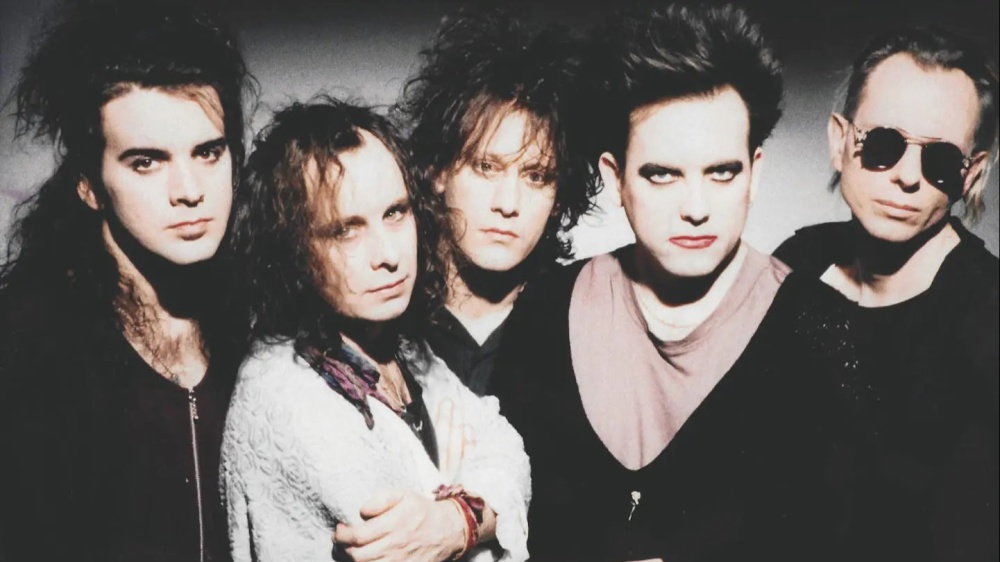
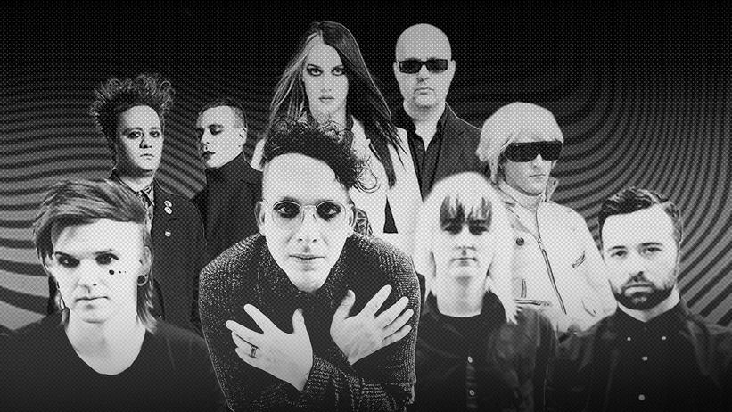
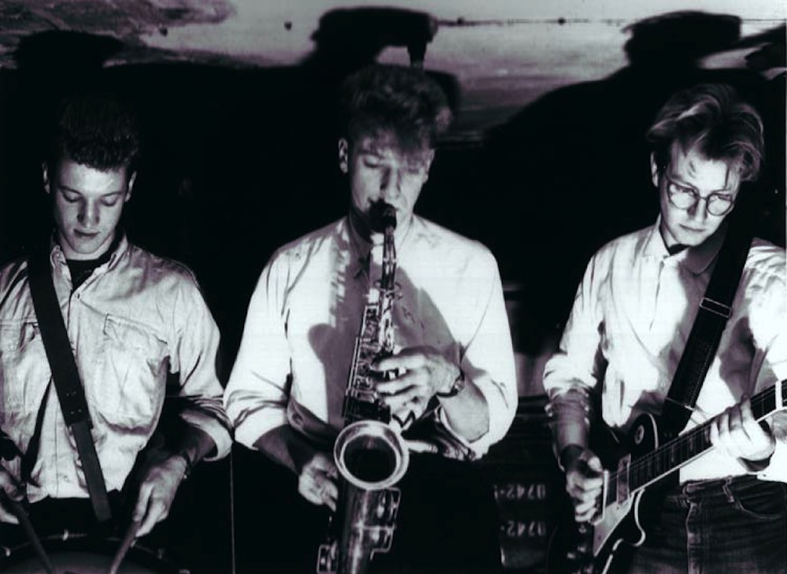
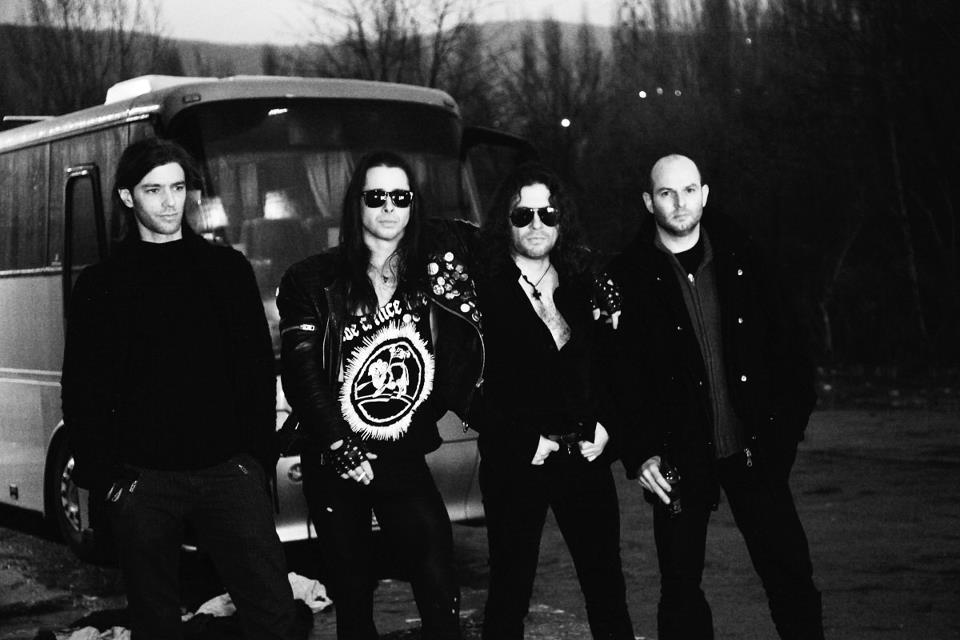
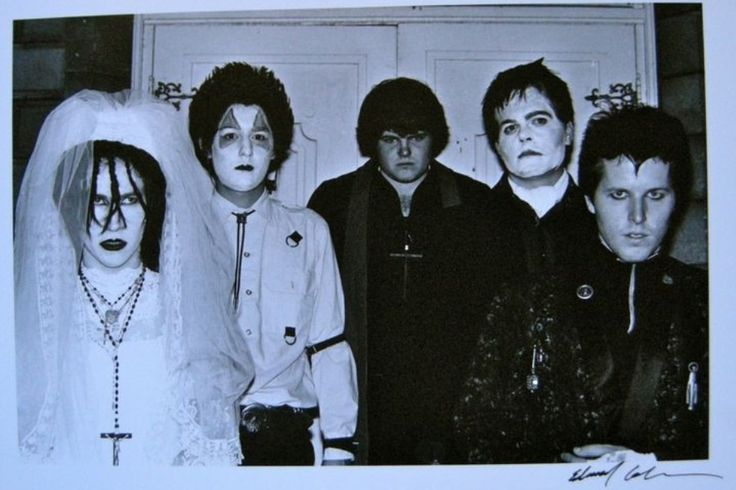
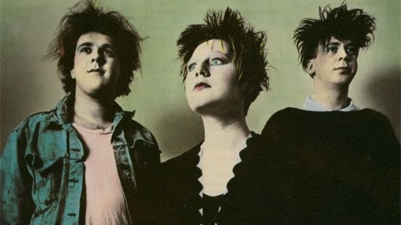

#

Come già detto nel post relativo alla storia, la musica goth è figlia del post-punk, spesso viene confusa dalle persone disinformate con l'heavy metal, ma non perchè si assomiglino sonoramente, azni **sono molto diverse**, l'heavy metal ha dei ritmi molto aggressivi portati avanti da distorsioni del suono delle chitarre, accompagnate spesso da urla maschili esasperate (spesso ascoltato per scaricare la rabbia), a volte, dagli ignoranti, definite "sataniche", mentre la musica goth, soprattutto alcuni suoi sottogeneri, è più **eterea e delicata**, ascoltata per trasmettere **passione**, **emotività mistero fascino** e a volte sensualità (eccezione per qualche sottogenere). Ma allora perché vengono confusi? Per via degli stereotipi. La gente tende ad associare l'apparenza molto tetra e cupa dello stile goth, ovvero il modo di vestire, con il satanismo e la stregoneria che a sua volta vengono streotipicamente associati all'aggressività e sopraffacenza della fonetica della musica metal.

----------
**NEW WAVE**
---------
La new wave è il primo genere musicale che darà inizio allo sviluppo della musica goth, distaccandosi dal post-punk (non a caso si chiama "new wave" che significa "nuova onda"), infatti si può dire che la new wave è una **rielaborazione della musica punk ma con un approccio stilistico cosciente e motivato**, darà vita in futuro ad altri sottogeneri. Nasce nella seconda metà degli anni settanta nel Regno Unito, questo termine verrà coniato nel 1976; farà molto successo negli Stati Uniti nei primi anni ottanta, diffondendosi anche in germania, mentre in Italia farà molta fatica a diffondersi per via della scarsa attenzione prestata dai media nazionali per questo genere. Esso si distinguerà dal genere post-punk per essere più vicino alla muisca pop, e prende ispirazione da fonti come musica disco, musica mod e musica elttronica. Essa assume caratteri molto **sincopati**, **aggressivi** e **poco consolatori**, inoltre, la chitarra, strumneto importante per la muusica rock, passa in secondo piano, si può dire che viene sostituita dal **basso**.
Strumenti che si prediligono: batteria, basso, plettro, chitarra, sintetizzatore, tastiera, batteria elettronica.

Alcuni esponenti: *Soft cell, **The Cure**, Depeche Mode, Ministry, New Order, The Human League, Tears for Fears, Ultravox, OMD, Erasure, Pet Shop Boys;*

-------------
**DARK WAVE**
-----
Il dark wave è un genere musicale figlio del post-punk, possiamo dire che è un **misto tra goth rock e new wave**, si chiama appunto così per rappresentare la **controparte** di quest'ultima. Si sviluppa nella seconda metà degli anni settanta, ma le sarà affibbiato questo termine solo nei primi anni ottanta. In Italia all'inizio degli anni ottanta veniva volgarmente usato il termine **"dark"** (che sarebbe l'abbreviazione di Dark) per riferirsi alle persone goth, quest'ultimo termine si è diffuso in Italia solo alla fine degli anni ottanta. Il darkwave combina alcune caratteristiche del gothic rock con la **musica elettronica**. questo genere è caratterizzato da un ampio uso di tonalità in chiave minore, questo per dare un'energia oscura desolata e di dolore. Questo genre darà vita ad altri sottogeneri come il cold wave, neoclassic dark wave, ethereal wave ecc...
Strumenti che si prediligono: chitarra elettrica, chitarra acustica, sintetizzatore, batteria, batteria elettronica, tastiera, violino,campionatore, drum machine;

Alcuni esponenti: *Depeche Mode,**Night Club**, **She Past Away**, **Creux Lies**, Siouxie and the Banshees, Soft Cell, Depeche Mode, Minut Machine, Wire Spine, New Haunts, IAMTHESHADOW, Black Nail Cabaret;*

--------------
**NEOCLASSIC DARK WAVE**
----
La neoclassic dark wave è un **sottogenere della dark wave** e nasce verso la metà degli anni ottanta. Una sua cartteristica è la presenza di una atmosfera eterea alimentata da voci di soprano, inutile dire che si chiama così per via di una forte influenza della **musica classica**, quest'ultima combinata con **energie cupe e malinconiche**. Questa fa spesso uso di stili formali associati alla muisca orchestrale.
Strumenti che si prediligono: pianoforte, clavicembalo, strumenti ad arco, sintetizzatore;

Alcuni esponenti: *Dead can dance, **In the Nurcery**, Black Tape for a Blue Girl, Elend , Dark Sanctuary, Sopor Aeternus & The Ensemble of Shadows;*

-------------
**COLD WAVE**
-----
La cold wave nasce verso la fine degli anni settanta in Francia e Belgio ma si diffonderà anche in Polonia dove avrà un ruolo importante, inizialmente questo termine verrà associato a una musica che ricorderà generi come new wave, goth rock, dark wave e post-punk ma poi verrà assorbito da generi corrispettivi al **minimal wave**. Il cold wave è estremamente dipendente dai sintetizzatori. Questo genere nasce come mezzo per esprimenre un **disagio sociale** e un certo **pessimismo verso il futuro**, infatti non tratta temi molto allegri. La cold wave non vivrà a lungo infatti scomparirà nel decennio successivo perchè molti gruppi si scioglieranno e non se ne creeranno nuovi. Strumenti che si prediligono: chitarra, basso elettrico, sintetizzatore, percussioni, drum machine;
 
Alcuni esponenti: *Asylum Party, KaS Product, Martin Dupont, Trisomie 21, **Soror Dolorosa**, Chemlab, 16volt, Acumen Nation, Winter Severity, Joanna Makabresku, Made in Poland, Kosmetyki Mrs, Pinki;*

--------------
**DEATH ROCK**
------
Il Death Rock si sviluppa nei tardi anni settanta nella costa orientale degli Stati Uniti, in realtà questo termine nasce molto prima, nel 1958, per riferisi a un sottogenere nato dal rock, ma poi verrà affibiato ad altro. Esso nasce come figura di **contrapposizione del genere post-punk e della new wave**, si trattano argomenti molto cupi come la **morte** e la **depressione**, decadenza, autodistruzione concettuale, visioni cimiteriali, infatti i testi sono molto angoscianti e paranormali; questa musica si ispira ai **film horror** e al **surrealism**o, spesso la voce risalta molto sulla parte strumentale. Questo genere avrà una fase di stallo verso la fine degli anni ottanta ma avrà un revival alla fine degli anni novanta nella California.
Strumenti che si prediligono: chitarra, bassso, tastiera, batteria, sintetizzatore;

Alcuni esponenti: *BURNING IMAGE, MIGHTY SPHINCTER, EX-VOTO KOMMUNITY FK, FRANKENSTEIN*

------------
**GOTH ROCK**
-----
Il gothic rock è uno dei più importanti sottogeneri della musica goth, esso nasce agli inizi degli anni ottanta nel Regno Unito si distingue dal post punk per via delle sue **melodie drammatiche e malinconiche**, uso di reverberi e deley, esso prende isprazione dalla **letteratura gotica**, ma con temi che ricordano il romanticismo la malinconia e la tragedia.
Gli argomenti prevalenti sono l'**idealizzazione della morte**, l'**amore** e il **soprannaturale**, in poche parole temi abbastanza oscuri.
Spesso i cantamti goth usano un timbro vocale profondo e drammatico. Strumenti che si prediligono: la chitarra, il basso, la batteria, il sintetizzatore, la tastiera e il pianoforte.

Alcuni esponenti: *Ikon, **The Sisters of Mercy**, London After Midnight, Skeletal Family, Christian Death, The Mission, Sex Gang Children, Alien Sex Friend;*

----------------
**ETHEREAL WAVE**
-----
L'ethereal wave è un sottogenere della dark wave, si distingue abbastanza dai generi citati sopra, si sviluppa molto dopo, fine anni novanta nel Regno Unito e Stati Uniti. Qui si usa uno sfondo musicale atmosferico grazie all' uso di **riverberi** e **deley**. Spesso è presente una voce sussurrata o una **voce lirica femminile** che hanno l intenzione di creare un'atmosfera ultraterrena. A differenza degli altri generi qui non si vuole trasmettere sensaazioni negative, l'atmosfera è sempre tetra e cupa, ma si vuole trasemttere principalmente **mistero**, un qualcosa che ha una verità accoulta dietro, un significato **esoterico**, non a caso il termine "etereo" si usa per indicare qualcosa di soprannaturale e non materiale, o metaforicamente parlando, qualcosa di troppo bello per esistere. L'ethereal wave però è uno tra tutti questi sottogeneri che ha avuto non troppa popolarità.
Strumenti che si prediligono: sintetizzatore, violino, flauto, pianoforte, drum machine, chitarra, basso, Theremin.

Alcuni esponenti: **Cocteau Twins**, Autumn's Grey Solace, This Mortal Coil, This Ascension, The Birthday Party,*

---------------

 

Altri generi che sono stati una fonte di ispirazione per la musica goth o che ne sono una derivante o che semplicemente hanno un ruolo molto periferico sono: dream pop, shoegaze, neofolk, metal, rock.