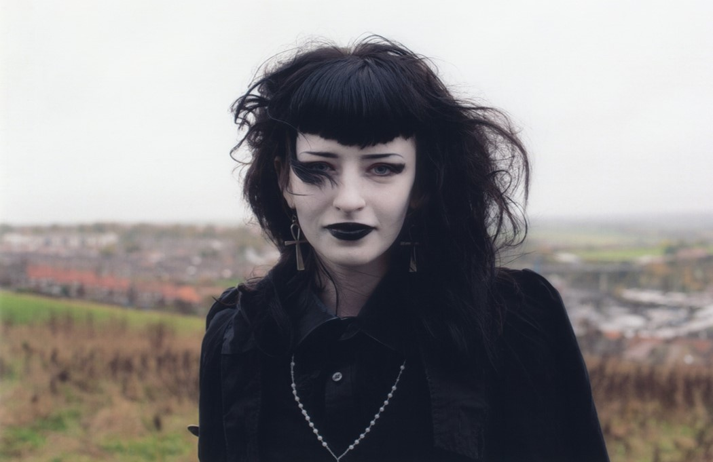

# 

Il Goth è un insieme di sottoculture che inizialmente si sono sviluppate intorno alla fine degli anni settanta e l’inizio degli anni ottanta nel Regno Unito, ma che poi si sono propagate in altre parti del mondo creando più varietà; esse sono principalmente accomunate da musica, ideali, modo di vestire e apparire (moda, trucco, acconciatura ecc...). Il termine goth derviva da “Goti”, un popolo dell’ europa nordica e occidentale considerato barbarico, che è stato causa della caduta dell’impero romano, infatti fino al settecento il termine assume un significato negativo anche a causa della cristianizzazione in Europa, fin quando nel regno unito si inziò a sviluppare una nostalgia per l’arte gotica (in inglese "gothic", che è la versione estesa del termine "goth", termine affibbiato all'arte gotica durante il periodo illuminista), così questa gente nostalgica venne rinominata da *Horace Walpole* “Goth”: per la prima volta il termine inizia a non avere una connotazione negativa.

Ritornando ai giorni d'oggi, l'inclinazione al gotico tra la gente comune è relativa a:

**La musica Goth**, che nasce intorno agli anni ottanta, figlia del post-punk, non a caso il Goth è derivante dal movimento sociale punk;

**Gusti e ideali**, ovvero si tende a provare fascino e interesse per l'arte, il mondo spirituale e ogni cosa che possa essere considerato tetro sinistro e decadente, questo perchè la sottocultura goth si ispira all'estetica cupa del romanzo medievale, della musica gotica e dei film; si è attratti da tetrezza non perchè (come alcuni pensano) possa essere considerata cattiva e minacciosa, ma perchè viene associata alla morte, ed essa viene vista benevolmente come parte del ciclo della vita; inoltre si crede nell'amore eterno e a credere nella vita dopo la morte. Si tende a rifiutare il conservatorismo, infatti la cultura gotica è basata sulla tolleranza verso la diversità, quindi se sei goth non puoi essere razzista omofobo misogino o con qualsiasi altra forma di xenofobia.

**Stile**, si tende ad indossare capi di abbigliamento di colore nero; nella cultura goth il colore nero rappresenta fascino e mistero, che a volte possono essere scambiati per intimidatori e relativi a qualcosa di malvolente; cio può essere causato da vari stereotipi sviluppatosi in conseguenza di avvenimenti storico-culturali, ma in generale ci sono alcuni studi psicologici che sono prova che vestirsi di nero può far sembrare più autorevoli e sicuri di sé. 
I capi di abbigliamento in questione variano in base alla sottocultura, possono essere:

 •più **eleganti e raffinati**, ornati con vari dettagli come vari *pizzi* nel colletto o nelle maniche di maglie e camicie, *guanti in tessuto*, *ombrelli da sole*, *corsetti*, *fiocchi*, *mantelli*, fantasie e ornamenti che possono vagamente ricordare i vestiari dell'*epoca vittoriana*, infatti il tema centrale di queste sottoculture è la storicità della moda, queste sottoculture si sono sviluppate intorno agli anni novanta nell'Europa nordica
 (*romantic goth,vampire goth, **victorian goth**);
  
• più **anticonformisti** e possibilmente provocatori, accessori con *borchie*, *maniche a rete*,* *chocker*, *reggicalze*, *stivali* con platform molto alte, *imbracature*, *maschere*, *locks* per capelli (**trad goth**, cyber goth, fetish goth*);
 
• più **trendy e graziosi**, trasmettono comunque mistero ma hanno delle caratteristiche che rendono l'aspetto del soggetto che li indossa più fanciullesco e sono orientati più verso la sfera femminile; accessori come *cuffie* da neonato, *parasole*, *ombrellini*, *fiocchi*, *nastri*, *calze* sopra il ginocchio, *gonne* stratificate e ornate in pizzo (**goth lolita**);

-Ci sono anche altri stili di questa cultura nati dopo o che comunque (che per ora) hanno una rilevanza storico culturale minore o che sono più legati a sottoculture sviluppatosi in periodi vicini a quello della cultura goth (*hippy goth, J-goth, perky goth, mopey goth, corp goth, medieval goth, emo goth, greek goth, gothability, cabaret goth, streampunk goth, faerie goth, tribal goth*).

----------

 Specificate le varietà presenti all'interno della cultura stessa ci sono comunque alcuni capi accessori e cosmetici che accomunano grosso modo tutte le sottoculture:
  accessori in argento, come *anelli*, *collane*, *catene* ecc...; in generale dei vestiari che rientrano nelle sfumature del nero, smalto nero, obretto e rossetto nero, tinte cosmetiche molto chiare usate come base make-up, croci e rosari, gioielli rappresentanti creature della notte e simboli della cultura goth (a cui è stato attribbuito un significato); 
  ma perchè i gioielli proprio in **argento**? Perchè i goti si definivano i figli della notte, dunque adoravano tutto ciò correlato all'oscurità, e quest'ultimo essendo un metallo lunare, rispecchia l'estetica di questa sottocultura.
Per quanto riguarda la capigliatura,la più comune acconciatura goth è quella con capelli molto voluminosi (volume acquisto grazie all'applicazione di lacca ed aver pettinato i capelli partendo dalle punte e andando verso le radici, anzichè il contrario) spesso (ma non per forza) accompagnati dalla frangetta sulla fronte.

C'è da specificare una cosa importantissima:

 ⚠️**il vestiario e l'apparenza esteriore sono un aspetto puramente opzionale, per essere considerati goth è necessario ascoltare musica goth ed avere degli ideali che rientrino in questa cultura**.⚠️
-----------
